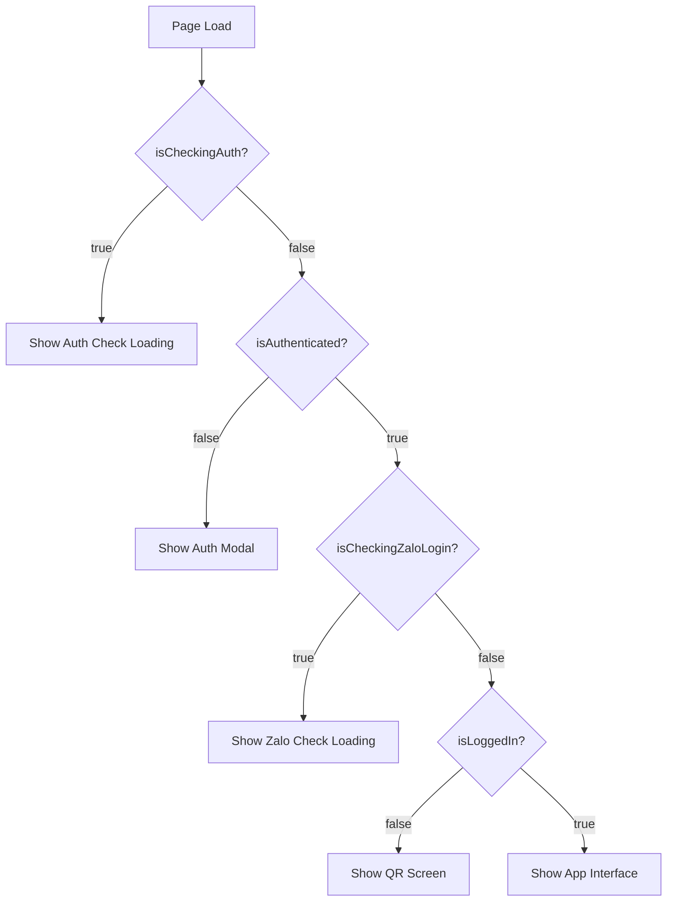

# ✅ Fix: Màn Hình QR Nhấp Nháy 0.5 Giây Khi F5

## ❌ Vấn Đề

Sau khi đăng nhập auth + Zalo, khi F5 (reload):
1. Loading "Đang kiểm tra phiên đăng nhập..." (0.2s)
2. **Flash màn hình QR login** (0.5s) ❌
3. Chuyển sang app interface

→ Gây confuse, tưởng phải login lại!

## 🔍 Nguyên Nhân

### Timeline Của Bug:

```
[Page Load]
  ↓
isCheckingAuth = true → Show "Đang kiểm tra phiên đăng nhập..."
  ↓ (0.2s)
isCheckingAuth = false, isAuthenticated = true
  ↓
Render main content với isLoggedIn = false → Show QR screen ❌
  ↓ (0.5s - đang fetch /api/zalo/login)
/api/zalo/login returns { loggedIn: true }
  ↓
isLoggedIn = true → Show app interface ✅
```

**Vấn đề:** Khoảng 0.5 giây giữa khi `isAuthenticated = true` và `isLoggedIn = true`, app hiển thị màn hình QR vì nghĩ chưa login Zalo.

## ✅ Giải Pháp

### Thêm State `isCheckingZaloLogin`

```typescript
const [isCheckingAuth, setIsCheckingAuth] = useState(true)       // Check auth (username/password)
const [isCheckingZaloLogin, setIsCheckingZaloLogin] = useState(false)  // 🔥 NEW: Check Zalo login
const [isLoggedIn, setIsLoggedIn] = useState(false)
```

### Timeline Sau Khi Fix:

```
[Page Load]
  ↓
isCheckingAuth = true → Show "Đang kiểm tra phiên đăng nhập..."
  ↓ (0.2s)
isCheckingAuth = false, isAuthenticated = true
  ↓
isCheckingZaloLogin = true → Show "Đang tải phiên Zalo Bot..." ✅
  ↓ (0.5s - đang fetch /api/zalo/login)
/api/zalo/login returns { loggedIn: true }
  ↓
isLoggedIn = true, isCheckingZaloLogin = false
  ↓
Show app interface ✅
```

**KHÔNG CÒN** flash màn hình QR!

## 📝 Code Changes

### 1. Thêm State
```typescript
const [isCheckingZaloLogin, setIsCheckingZaloLogin] = useState(false)
```

### 2. Wrap `initPage()` với Loading State
```typescript
useEffect(() => {
  if (!isAuthenticated) return

  const initPage = async () => {
    setIsCheckingZaloLogin(true)  // 🔥 Start loading
    try {
      // ... fetch settings, stats, login status
    } finally {
      setIsCheckingZaloLogin(false)  // 🔥 End loading
    }
  }

  initPage()
}, [isAuthenticated])
```

### 3. Thêm Loading Screen Cho Zalo Check
```typescript
// After auth check, before showing QR
if (isAuthenticated && isCheckingZaloLogin) {
  return (
    <main className="...">
      <div className="absolute inset-0 bg-dark-100/95 backdrop-blur-xl"></div>
      <div className="relative z-10 ...">
        <div className="w-12 h-12 border-4 border-sky-500 ... animate-spin"></div>
        <p>Đang tải phiên Zalo Bot...</p>
        <p className="text-xs">Đang kiểm tra kết nối với Zalo</p>
      </div>
    </main>
  )
}
```

## 🎯 Kết Quả

### Trước (Bug)
```
Auth Check (0.2s) 
  → QR Flash (0.5s) ❌ 
    → App Interface
```

### Sau (Fixed)
```
Auth Check (0.2s) 
  → Zalo Check (0.5s) ✅ 
    → App Interface
```

### Visual Difference
| State | Before | After |
|-------|--------|-------|
| 0-200ms | "Đang kiểm tra phiên..." | "Đang kiểm tra phiên..." ✅ |
| 200-700ms | **QR Screen** ❌ | "Đang tải phiên Zalo Bot..." ✅ |
| 700ms+ | App Interface | App Interface ✅ |

## 🧪 Test

1. **Đăng nhập** vào app (auth + Zalo)
2. **F5** (reload page)
3. **Quan sát:**
   - ✅ Loading 1: "Đang kiểm tra phiên đăng nhập..." (0.2s)
   - ✅ Loading 2: "Đang tải phiên Zalo Bot..." (0.5s)
   - ✅ Chuyển thẳng vào app
   - ✅ **KHÔNG** thấy màn hình QR nhấp nháy!

## 📊 Loading States Flow



## 📁 File Changed
- ✅ `app/page.tsx` - Added `isCheckingZaloLogin` state and loading screen

## 💡 Why This Works

1. **Prevents Flash:** Không render QR screen khi đang fetch Zalo status
2. **Better UX:** User thấy continuous loading thay vì flash screen
3. **Clear States:** Tách biệt auth check và Zalo login check
4. **No Breaking:** Không ảnh hưởng logic khác

## 🚀 Ready!
F5 và enjoy smooth loading experience! 🎉
